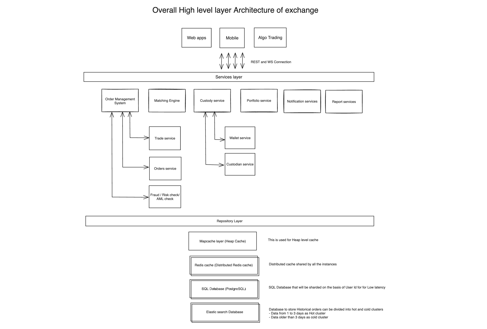
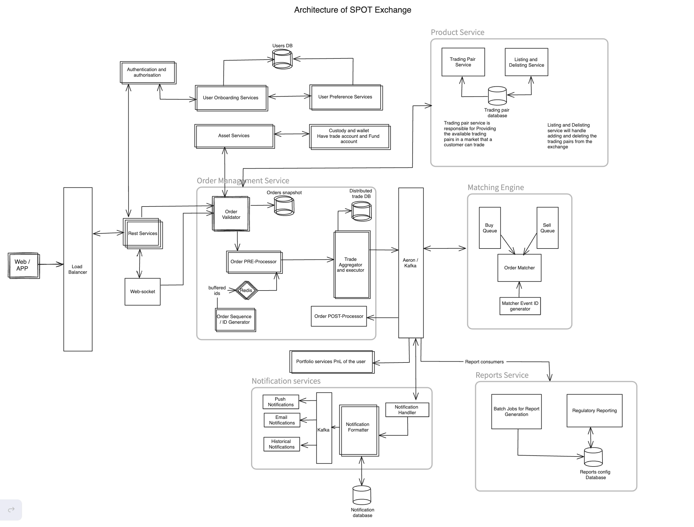
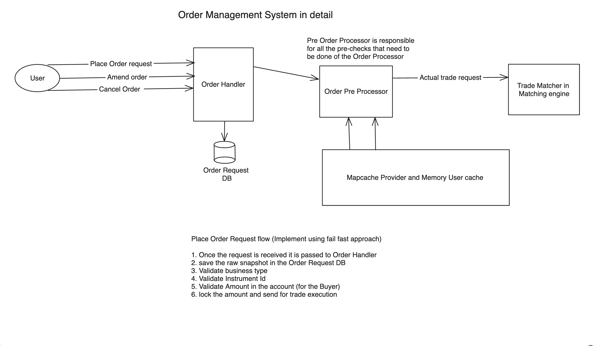
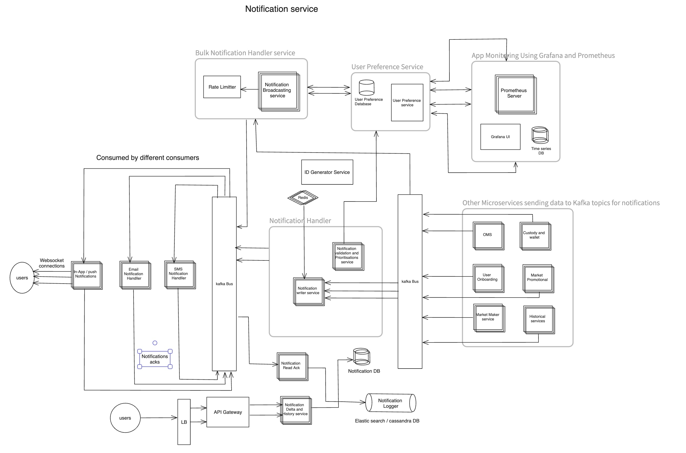

# This is a SPOT Exchange 

## Major services involved are 

- Market Data Service 
- Portfolio Service 
- Order Service 
- User Preference Service 
- Auth Service 
- Notification Service 
- Onboarding Service 
- Custody Service 
- Websocket Service

## The swagger endpoints are 

- Market Data Service started on http://localhost:8081/swagger-ui/index.html
- Portfolio Service started on http://localhost:8082/swagger-ui/index.html
- Order Service started on http://localhost:8083/swagger-ui/index.html
- User Preference Service started on http://localhost:8084/swagger-ui/index.html
- Auth Service started on http://localhost:8085/swagger-ui/index.html
- Notification Service started on http://localhost:8086/swagger-ui/index.html
- Onboarding Service started on http://localhost:8087/swagger-ui/index.html
- Custody Service started on http://localhost:8088/swagger-ui/index.html
- Websocket Service started http://localhost:8089/swagger-ui/index.html

## Details design for different services in scalable approach 

### SPOT Exchange Overview 

### SPOT Exchange Full detailed design

### OMS 

### Notification service

###